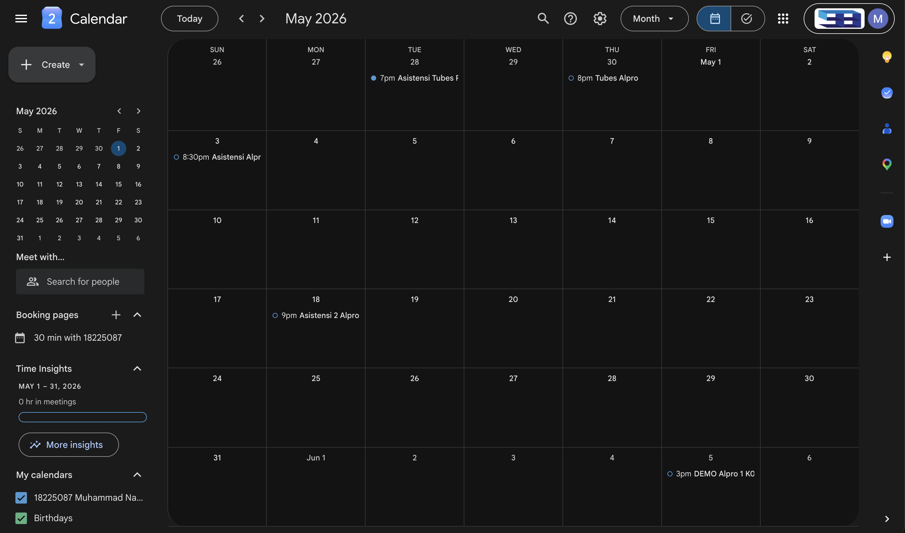
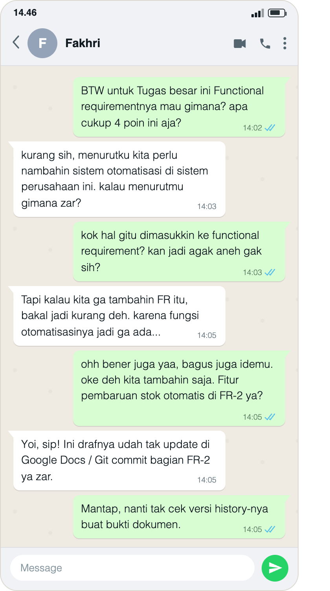
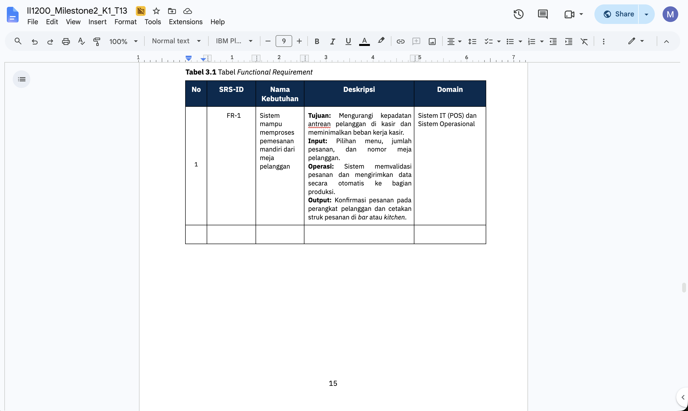
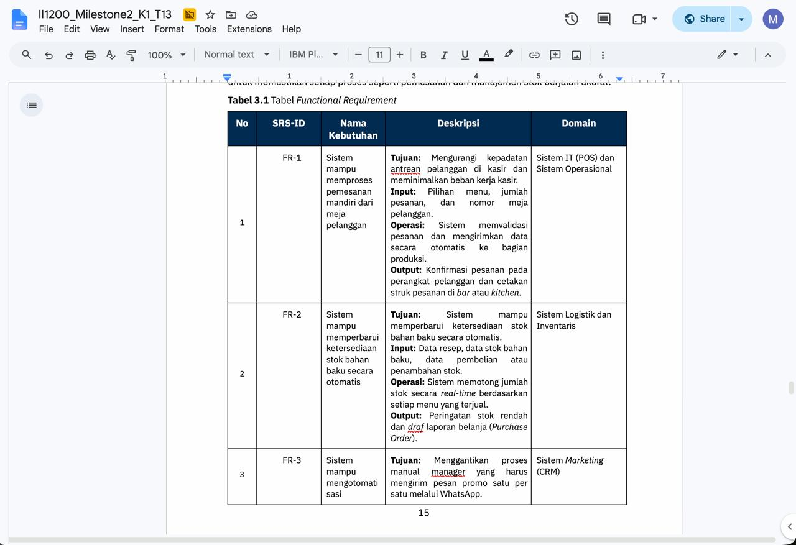

## Kompetensi target

Membedakan person, personality, dan character serta memilih objective, repertoire, dan language yang sesuai.

## Evidence wajib

- Lima character dari sedikitnya tiga domain kehidupan.
- Objective, responsibility, repertoire, dan risiko tiap character.
- Satu contoh perubahan language ketika character berubah.
- Artefak proses diskusi dan hasil tindak lanjut, dengan penjelasan bagian yang dapat dilihat pada setiap lampiran.

::: {.callout-tip title="Lihat contoh pengisian"}
[Buka contoh fiktif Minggu 1](../examples/week-01.qmd) untuk melihat tingkat kekonkretan evidence dan analisis.
:::

## Konteks performance

**Setting:** Saya berdiskusi tatap muka dan melalui pesan singkat dengan Fakhri tentang functional requirement pada bagian tugas besar yang membahas penambahan sistem di perusahaan. Saya juga berbicara melalui telepon dengan mama tentang kesulitan membagi waktu antara kegiatan dan tugas kuliah.

**Tanggal:** Tanggal diskusi tidak terlihat pada lampiran percakapan. Gambar kalender memperlihatkan Mei 2026 beserta beberapa entri akhir April, tetapi tidak menunjukkan kapan entri dibuat. Saya tidak menggunakan tanggal jadwal sebagai tanggal percakapan.

**Persons dan relationship:** Fakhri adalah teman satu kelompok. Dalam diskusi, saya berperan sebagai anggota kelompok yang ikut menilai dan menentukan isi tugas bersama. Dalam percakapan dengan mama, saya berperan sebagai anak yang menyampaikan kesulitan dan menerima dukungan. Hubungan dengan Fakhri relatif setara, sedangkan hubungan dengan mama bersifat keluarga dan personal.

**Objective dan initial state:** Dalam diskusi kelompok, saya ingin menentukan apakah empat poin functional requirement yang dibahas sudah cukup. Ketika Fakhri mengusulkan tambahan otomatisasi, saya awalnya kurang setuju dan mempertanyakan mengapa fungsi tersebut dimasukkan. Dalam percakapan keluarga, saya sedang merasa kesulitan membagi waktu karena mengikuti banyak kegiatan dan memiliki banyak tugas kuliah.

## Evidence

### Person, personality, dan character dalam pengalaman saya

**Person** adalah pribadi yang utuh, dengan pengalaman, kebutuhan, dan nilai. Saya memiliki tanggung jawab akademik sekaligus kebutuhan akan dukungan ketika kewalahan. Fakhri juga perlu didengarkan sebagai orang yang memiliki pemikiran tentang tugas bersama, bukan sekadar orang yang berbeda pendapat dengan saya.

**Personality** adalah kecenderungan dalam berpikir, merasa, dan bertindak. Hambatan yang saya kenali adalah kesulitan menyampaikan rasa kewalahan. Dalam percakapan dengan mama, saya berusaha menyampaikan kesulitan itu secara terbuka. Dalam diskusi dengan Fakhri, saya sempat merasa penambahan functional requirement kurang sesuai, tetapi tetap dapat mengubah penilaian setelah mempertimbangkan alasannya.

**Character** adalah peran dan tanggung jawab komunikasi yang saya jalankan sesuai situasi. Sebagai anggota kelompok, saya perlu menilai usulan sekaligus mendengarkan alasan teman. Sebagai anak, saya perlu menyampaikan keadaan diri dengan jujur dan menerima dukungan. Pribadinya tetap sama, tetapi tujuan dan tuntutan bahasanya berbeda.

### Peta lima character

| Domain dan character | Person dan relationship | Objective dan responsibility | Repertoire dan language | Risiko |
|---------------|---------------|---------------|---------------|---------------|
| Diri sendiri — **pembelajar yang reflektif** | Diri sendiri ketika menghadapi kesulitan atau meninjau keputusan | Mengenali keterbatasan dan menjadikan kesalahan atau masukan sebagai bahan perbaikan | Merefleksikan respons, mengakui kekurangan, dan menentukan langkah perbaikan | Sulit berkembang jika saya mempertahankan penilaian awal tanpa memeriksa alasan |
| Keluarga — **anak yang bertanggung jawab** | Mama sebagai orang tua yang memberi dukungan | Menyampaikan kesulitan dengan jujur, menjaga keterbukaan, dan menindaklanjuti saran yang sesuai | Bercerita dengan bahasa personal, mendengarkan saran, serta mengucapkan terima kasih | Mama tidak mengetahui kebutuhan saya apabila saya menyembunyikan rasa kewalahan |
| Akademik — **anggota kelompok yang terbuka** | Fakhri dan teman satu kelompok | Menilai isi tugas bersama dan mempertimbangkan usulan berdasarkan alasannya | Bertanya, menyampaikan keraguan, mendengarkan penjelasan, dan menyepakati keputusan | Usulan yang berguna dapat terlewat jika saya menolaknya hanya karena terasa aneh |
| Komunitas — **anggota HR IIT** | Anggota kepanitiaan IIT | Menilai performa anggota dan melakukan follow-up terhadap data yang belum diisi | Menjelaskan tujuan evaluasi, mengingatkan pengisian data, dan mendengarkan kendala | Follow-up dapat terasa seperti penagihan jika tujuan dan kendala anggota tidak dibicarakan |
| Publik — **presenter yang terbuka** | Audiens presentasi atau orang yang belum dekat dengan saya | Menjelaskan materi dengan jelas dan memberi ruang bagi audiens untuk merespons | Menyampaikan informasi secara terstruktur dan membuka kesempatan bertanya | Tidak adanya pertanyaan dapat keliru dianggap sebagai tanda bahwa audiens sudah memahami |

### Analisis risiko tiap character

| Character | Risiko dan pemicu | Dampak | Mitigasi dan statusnya | Indikator yang dapat diperiksa |
|---------------|---------------|---------------|---------------|---------------|
| Pembelajar yang reflektif | Menganggap penilaian awal pasti benar | Saya melewatkan alasan yang dapat memperbaiki keputusan | Meninjau kembali usulan Fakhri dan mengubah keputusan | Perbedaan respons awal, alasan yang diterima, dan persetujuan pada lampiran percakapan |
| Anak yang bertanggung jawab | Menyembunyikan kesulitan saat beban tinggi | Kebutuhan dukungan psikologis tidak terpenuhi | Menyampaikan kesulitan kepada mama dan membuat jadwal kegiatan | Catatan respons mama dan jadwal di Google Calendar |
| Anggota kelompok yang terbuka | Menolak tambahan fungsi secara spontan | Usulan yang berguna dapat terlewat sebelum alasannya dibahas | Mendengarkan penjelasan Fakhri dan menyetujui usulan | Perubahan respons pada lampiran percakapan dan perbedaan bagian tabel sebelum–sesudah yang menunjukkan FR-2; tanggal penyuntingan tidak terlihat |
| Anggota HR IIT | Mengingatkan pengisian data tanpa menjelaskan tujuan | Anggota dapat menghindari komunikasi | Rencana latihan: menjelaskan kegunaan data sebelum follow-up | Tanggapan anggota dan keterisian data evaluasi |
| Presenter yang terbuka | Menganggap audiens paham hanya karena diam | Kesalahpahaman materi tidak terdeteksi | Rencana latihan: meminta audiens merangkum poin utama secara singkat | Jawaban klarifikasi audiens setelah sesi presentasi |

### Nilai, kekuatan, dan hambatan komunikasi

Nilai yang ingin saya jaga adalah kejujuran dan keadilan. Kejujuran terlihat ketika saya menyampaikan kesulitan kepada mama. Keadilan dalam diskusi kelompok berarti memberi ruang bagi Fakhri untuk menjelaskan pendapatnya dan mempertimbangkan alasan tersebut sebelum menentukan keputusan bersama.

Kekuatan yang terlihat pada kedua episode adalah kesediaan menerima masukan. Saya menerima usulan Fakhri dan saran mama. Hambatan yang perlu saya perhatikan adalah kecenderungan memberi respons negatif sebelum memahami suatu usulan, serta kesulitan menyampaikan rasa kewalahan.

### Episode 1 — Diskusi functional requirement dengan Fakhri

Saya dan Fakhri membahas apakah empat poin functional requirement pada bagian tugas besar sudah cukup. Fakhri mengusulkan penambahan otomatisasi pada draf FR-2.

Dialog berikut mengikuti teks pada gambar percakapan yang saya berikan. Ucapan tentang pembaruan draf merupakan pernyataan Fakhri; perbandingan gambar dokumen sebelum–sesudah disertakan untuk memperlihatkan bagian yang berubah. Riwayat versi dengan metadata pengedit dan tanggal tetap tidak ditampilkan oleh gambar.

> **Izar:** “BTW untuk Tugas besar ini Functional requirementnya mau gimana? apa cukup 4 poin ini aja?”\
> **Fakhri:** “kurang sih, menurutku kita perlu nambahin sistem otomatisasi di sistem perusahaan ini. kalau menurutmu gimana zar?”\
> **Izar:** “kok hal gitu dimasukkin ke functional requirement? kan jadi agak aneh gak sih?”\
> **Fakhri:** “Tapi kalau kita ga tambahin FR itu, bakal jadi kurang deh. karena fungsi otomatisasinya jadi ga ada...”\
> **Izar:** “ohh bener juga yaa, bagus juga idemu. oke deh kita tambahin saja. Fitur pembaruan stok otomatis di FR-2 ya?”\
> **Fakhri:** “Yoi, sip! Ini drafnya udah tak update di Google Docs / Git commit bagian FR-2 ya zar.”\
> **Izar:** “Mantap, nanti tak cek versi history-nya buat bukti dokumen.”

**Response dan agreement:** Saya berubah dari mempertanyakan usulan menjadi mengakui alasan Fakhri, menghargai idenya, dan menyatakan persetujuan. Fakhri menyampaikan bahwa draf telah diperbarui. Pada gambar yang saya berikan sebagai versi sebelum, bagian setelah FR-1 masih kosong; pada gambar hasil akhir, bagian itu memuat FR-2 pembaruan stok otomatis. Tindakan yang saya laporkan adalah penambahan requirement ke dokumen, bukan implementasi fitur pada aplikasi.

### Episode 2 — Percakapan dengan mama

Saya menyampaikan rasa kewalahan melalui telepon. Dialog ini merupakan catatan isi percakapan yang saya laporkan, bukan transkrip rekaman. Tindak lanjut yang saya laporkan adalah pembuatan jadwal kegiatan.

> **Izar:** “mama, aku ngerasa susah banget bagi waktu di kuliah sekarang..”\
> **Mama:** “gapapa zar semangat, mama percaya kamu pasti bisa. emangnya kesulitanmu kenapa?”\
> **Izar:** “aku ikut banyak kegiatan sama tugas kuliah yang banyak ma”\
> **Mama:** “Owalah, mama tau pasti berat bagimu zar. tapi yang udah ada sekarang pasti yang terbaik untuk masa depanmu nanti. coba kamu buat jadwal kegiatan deh biar bisa lebih management waktu dengan baik”\
> **Izar:** “okei ma, aku bakal coba ituu. makasih mamaku sayang”\
> **Mama:** “iya izar sayangku”

### Bukti tindak lanjut — jadwal Google Calendar

{#fig-w01-calendar width="100%"}

[Buka screenshot jadwal Google Calendar di Google Drive](https://drive.google.com/file/d/1obuDX5cLhedwmUY9A-mIu_uXhKYJAHo1/view?usp=sharing){target="_blank" rel="noopener"}

Gambar mendukung adanya jadwal kegiatan. Kaitan jadwal dengan saran mama berasal dari pengalaman yang saya ceritakan; waktu pembuatan entri dan keberhasilan menjalankan seluruh kegiatan tidak ditunjukkan oleh gambar.

### Bukti proses — percakapan bersama Fakhri

{#fig-w01-discussion width=480}

[Buka screenshot bukti log chat diskusi W01-F di Google Drive](https://drive.google.com/file/d/1VNN6fiDL-nsS3VtuuefEieteu1Ve0ECB/view?usp=sharing){target="_blank" rel="noopener"}

Nama Fakhri dan perubahan respons terlihat pada lampiran. Tanggal percakapan tidak ditampilkan. Gambar disajikan tanpa perubahan isi; keaslian sumber tidak ditetapkan hanya berdasarkan tampilannya.

### Bukti proses dan hasil — dokumen sebelum–sesudah FR-2

Kedua gambar berikut menampilkan halaman **15** dokumen **II1200_Milestone2_K1 T13**, bagian **Tabel 3.1 — Functional Requirement**. Gambar pertama saya berikan sebagai draf sebelum penambahan FR-2, sedangkan gambar kedua sebagai hasil setelah penambahan. Perbandingan difokuskan pada bagian tabel yang benar-benar terlihat, bukan jumlah requirement pada seluruh dokumen.

| Bagian yang diperiksa | Sebelum | Sesudah |
|---|---|---|
| Identitas dokumen | `II1200_Milestone2_K1 T13`, halaman 15, Tabel 3.1 | Nama dokumen, halaman, dan nomor tabel sama |
| Isi setelah FR-1 | Baris berikutnya yang terlihat masih kosong; FR-2 belum tampak | FR-2 pembaruan stok bahan baku otomatis tercantum beserta deskripsinya |
| Rincian stok otomatis | Tidak terlihat pada bagian tabel yang ditampilkan | Kebutuhan, input, operasi pemotongan stok, output, dan domain FR-2 terlihat |

Jumlah requirement keseluruhan dari empat menjadi lima tidak disimpulkan dari gambar ini karena seluruh tabel tidak ditampilkan. Empat poin yang disebut pada dialog merupakan konteks percakapan, bukan hasil penghitungan dari potongan gambar.

#### Draf sebelum

{#fig-w01-before width="100%"}

[Buka file sumber draf sebelum di Google Drive](https://drive.google.com/file/d/1TszGRY0oBjXJB90B0G_wGZPnMnlVmITp/view?usp=sharing){target="_blank" rel="noopener"}

#### Hasil sesudah

{#fig-w01-requirement width="100%"}

[Buka file sumber hasil sesudah di Google Drive](https://drive.google.com/file/d/1ki1TdsqdeXi5lDDJf-omqpyDSsmY1dBr/view?usp=sharing){target="_blank" rel="noopener"}

Rincian FR-2 yang dapat dibaca pada gambar sesudah:

| Parameter Verifikasi | Detail pada Dokumen Draf |
|---|---|
| **Dokumen & Halaman** | `II1200_Milestone2_K1 T13`, Halaman 15 |
| **Isi Requirement** | **FR-2:** *Sistem mampu memperbarui ketersediaan stok bahan baku secara otomatis* |
| **Spesifikasi Detail** | **Domain:** Sistem Logistik dan Inventaris. **Input:** Data resep, data stok bahan baku, data pembelian atau penambahan stok. **Operasi:** Pemotongan stok real-time berdasarkan setiap menu yang terjual. **Output:** Peringatan stok rendah dan draf laporan belanja (*Purchase Order*). |
| **Batas Pemeriksaan** | Gambar sebelum–sesudah memperlihatkan perbedaan isi pada bagian tabel. Metadata tanggal dan nama pengedit tidak terlihat; peran Fakhri dalam pembaruan draf berasal dari pernyataannya pada lampiran percakapan. |

::: evidence-block
Lampiran percakapan memuat perubahan respons dan pernyataan pembaruan draf. Pasangan gambar yang saya berikan sebagai sebelum–sesudah memperlihatkan bagian tabel tanpa FR-2 yang terlihat, kemudian bagian yang memuat requirement tersebut. Dengan begitu, pembaca dapat membandingkan isi dokumen secara langsung, bukan hanya membaca laporan hasil akhirnya. Lampiran kalender menunjukkan adanya jadwal kegiatan.

Label sebelum–sesudah mengikuti keterangan saya sebagai pemberi sumber. Gambar tidak menampilkan riwayat versi, tanggal penyuntingan, atau identitas akun pengedit; kaitannya dengan diskusi berasal dari catatan percakapan dan pengalaman yang saya laporkan. Keaslian sumber tidak ditetapkan hanya dari tampilan gambar. Perbandingan ini mendukung perubahan isi dokumen yang ditampilkan, bukan pembangunan atau pengujian fitur aplikasi.
:::

### Perubahan language dan kontras dua character

**Adaptasi di dalam peran anggota kelompok:** Saya berubah dari “kok hal gitu dimasukkin ke functional requirement? kan jadi agak aneh gak sih?” menjadi “ohh bener juga yaa, bagus juga idemu. oke deh kita tambahin saja”.

**Perubahan ketika character berbeda:** Dengan Fakhri, saya memakai istilah tugas seperti “functional requirement”, “4 poin”, dan “FR-2”. Dengan mama, saya menggunakan “aku ngerasa susah banget”, “ma”, dan “makasih mamaku sayang”.

| Unsur | Anggota kelompok bersama Fakhri | Anak dalam percakapan dengan mama |
|------------------------|------------------------|------------------------|
| Objective | Menentukan isi functional requirement bersama | Menyampaikan kesulitan membagi waktu dan menerima dukungan |
| Repertoire | Bertanya, mempertanyakan, mendengarkan alasan, dan menyepakati usulan | Bercerita tentang keadaan diri, mendengarkan saran, dan mengucapkan terima kasih |
| Language | Bahasa santai antarteman dengan istilah teknis tugas | Bahasa personal dan akrab dalam hubungan keluarga |
| Response | Fakhri menjelaskan mengapa fungsi otomatisasi perlu ditambahkan | Mama memberi semangat dan menyarankan membuat jadwal |
| Agreement/action | Lampiran percakapan memuat persetujuan dan pernyataan pembaruan draf; gambar sebelum–sesudah memperlihatkan perbedaan bagian tabel yang memuat FR-2 | Saya melaporkan tindak lanjut membuat jadwal; gambar kalender memperlihatkan entri kegiatan |
| Relationship | Menunjukkan penghargaan atas usulan teman | Menunjukkan keterbukaan dan rasa terima kasih kepada orang tua |

## Analisis komunikasi

| Elemen | Evidence dan analisis |
|------------------------------------|------------------------------------|
| Person & character | Pribadi yang sama menjalankan peran anggota kelompok dan anak. |
| Objective & state | Diskusi kelompok bertujuan menentukan isi FR; percakapan dengan mama bertujuan mengurai rasa kewalahan. |
| Repertoire & language | Menggunakan istilah teknis pada diskusi kelompok dan bahasa personal dalam percakapan keluarga. |
| Response & adaptation | Penjelasan Fakhri membuat saya mengubah penilaian keraguan awal menjadi persetujuan. |
| Agreement/action | Persetujuan tercatat dalam lampiran percakapan. Perbedaan bagian tabel sebelum–sesudah mendukung penambahan requirement FR-2; kalender menunjukkan jadwal kegiatan. Metadata penyuntingan dan implementasi aplikasi tidak ditunjukkan. |
| Relationship outcome | Kalimat penghargaan terhadap ide Fakhri dan ucapan terima kasih kepada mama menunjukkan keterbukaan dalam kedua episode. Perubahan hubungan jangka panjang tidak disimpulkan dari episode ini saja. |

## Penggunaan AI

AI tidak digunakan dalam percakapan atau pengambilan keputusan ini. AI membantu menata Markdown, memperinci analisis, mencocokkan kutipan dengan lampiran, serta memasang gambar langsung di repo. Instruksi utama saya adalah memperbaiki portofolio sesuai feedback tanpa menambahkan fakta atau bukti baru yang tidak tersedia.

## Feedback dan tindak lanjut

**Feedback yang diterima:** Fakhri menjelaskan pentingnya otomatisasi stok pada draf. Mama menyarankan pembuatan jadwal kegiatan. Evaluasi tiket 662 meminta riwayat perubahan dokumen atau bukti sebelum–sesudah untuk melihat proses perubahan, bukan hanya isi akhir.

**Adaptasi dan tindak lanjut:** Saya menerima alasan Fakhri dan melaporkan pembuatan jadwal setelah saran mama. Gambar percakapan, draf sebelum, hasil sesudah, dan kalender ditampilkan langsung pada halaman. Bagian tabel yang berubah serta rincian FR-2 dijelaskan agar pembaca dapat memeriksa perbedaannya. Saya tidak menambahkan tanggal penyuntingan atau identitas pengedit yang tidak terlihat pada gambar.

**Refleksi:** Mendengarkan alasan teman membantu saya mengubah respons dari keraguan menjadi persetujuan. Saya juga perlu menyimpan dokumen sebelum dan sesudah perubahan agar tindak lanjut dapat ditelusuri. Potongan gambar menunjukkan perbedaan isi, tetapi tidak boleh digunakan untuk mengarang tanggal, jumlah requirement keseluruhan, atau riwayat pengeditannya.

**Next practice:** Saya akan menyimpan versi dokumen sebelum diskusi dan sesudah kesepakatan, lalu mencatat bagian yang berubah, pengedit, serta tanggalnya. Jika dokumentasi lama tidak tersedia, kegiatan lanjutan akan saya catat dengan tanggal sebenarnya dan tidak saya sebut sebagai bukti kejadian lama.

## Self-assessment

| Dimensi | Skor 1–4 | Evidence singkat |
|----------------------|----------------------------:|----------------------|
| Person & Character | 4 | Lima character dipetakan. Dialog menunjukkan perbedaan peran anggota kelompok dan anak. |
| Objective & State | 4 | Membedakan tujuan menilai isi tugas dari tujuan menyampaikan kesulitan diri. |
| Repertoire, Language & AI | 3 | Pilihan bahasa teknis antarteman dan bahasa personal dengan mama dijelaskan; peran AI dan batas pemeriksaan lampiran dinyatakan. |
| Response & Adaptation | 4 | Percakapan Fakhri menunjukkan perubahan respons; pembuatan jadwal menjadi tindak lanjut saran mama. |
| Agreement, Action & Relationship | 3 | Persetujuan, perbandingan bagian tabel sebelum–sesudah FR-2, dan jadwal tersedia; metadata penyuntingan serta pelaksanaan aplikasi tidak diklaim. |

**Total:** 18 / 20

Skor ini merupakan penilaian mandiri, bukan keputusan dosen atas kelengkapan bukti.

::: assessor-only
### Assessment dosen

**Skor:** — / 20\
**Evidence yang mendukung:** —\
**Prioritas perbaikan:** —\
**Keputusan:** Belum dinilai / Perlu revisi / Tercapai
:::
