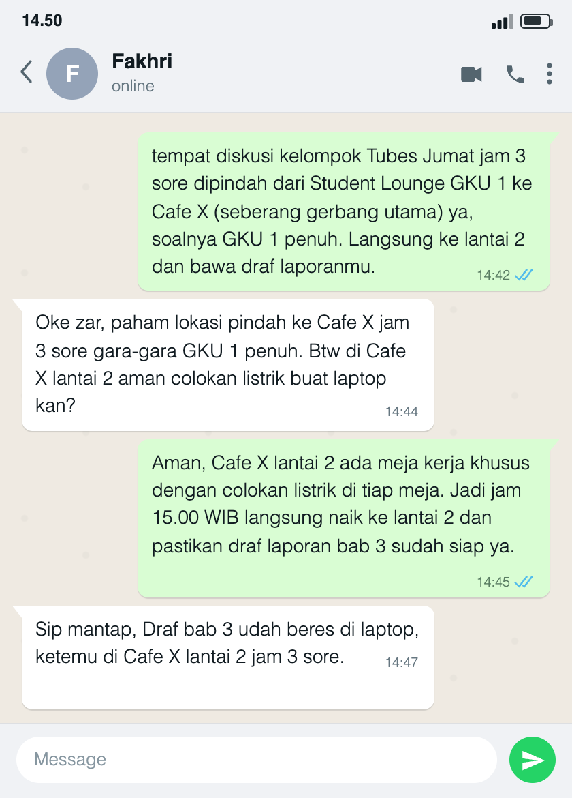

## Kompetensi target

Mengadaptasi repertoire dan language tanpa mengubah core meaning, lalu memeriksa pemahaman melalui respons penerima.

## Evidence wajib

- Lima versi bahasa untuk friend, technical peer, manager, customer/user, dan public.
- Alasan perubahan language dan repertoire tanpa mengubah fakta utama.
- Feedback understanding dan adaptasi lanjutan (*replay*) yang diikuti konfirmasi penerima.
- Lampiran percakapan beserta penjelasan tentang kontribusi saya dan batas hasil yang dapat diperiksa.

## Konteks performance

**Tanggal dan setting:** Lampiran menunjukkan percakapan berformat WhatsApp pada pukul 14:42–14:47. Tanggal kalender percakapan tidak tercantum. Pesan membahas jadwal diskusi hari Jumat pukul 15.00 WIB, bukan tanggal pengambilan gambar yang dapat dipastikan dari lampiran.

**Persons dan relationship:** Saya berbicara dengan Fakhri, teman satu kelompok Tugas Besar. Hubungan kami setara sebagai anggota kelompok. Fakhri menjadi penerima yang tercatat dalam lampiran, sedangkan kelima profil pada tabel di bawah merupakan sasaran draf adaptasi bahasa. Saya tidak menyatakan kelima versi sudah diuji kepada lima peserta.

**Objective dan initial state:** Saya mau memastikan Fakhri mengetahui perubahan tempat dan tetap datang sesuai jadwal dengan draf laporan. Pesan awal menjelaskan bahwa Student Lounge GKU 1 penuh. Respons Fakhri menunjukkan bahwa waktu dan tempat sudah dipahami, tetapi ia masih perlu kepastian tentang colokan listrik untuk laptopnya.

## Evidence

### Core meaning

**Fakta yang dijaga:** Diskusi kelompok Tugas Besar hari Jumat pukul 15.00 WIB dipindahkan dari Student Lounge GKU 1 ke Cafe X, seberang gerbang utama, lantai 2, karena lokasi awal penuh. Anggota diminta membawa draf laporan; pada pesan lanjutan, bagian yang ditegaskan adalah Bab 3.

Nama tempat dan rincian pada bagian ini mengikuti isi lampiran. Saya tidak menambahkan jam selesai, kewajiban export PDF, biaya konsumsi, atau persyaratan lain yang tidak disebut dalam percakapan.

### Lima draf language dan alasan adaptasi

Kelima versi berikut adalah draf untuk kebutuhan audiens yang berbeda. Versi customer/user paling dekat dengan pesan yang tercatat kepada Fakhri; tabel bukan transkrip lima percakapan.

| Target/character | Versi language | Alasan adaptasi |
|---|---|---|
| Friend | “Bro, diskusi Tubes Jumat jam 3 sore dipindah dari Student Lounge GKU 1 ke Cafe X seberang gerbang utama, lantai 2 ya, soalnya tempat awal penuh. Draf laporan bab 3 jangan lupa dibawa.” | Sapaan akrab dan kalimat langsung cocok untuk teman. Waktu, alasan, lokasi awal dan baru, serta draf yang perlu dibawa tetap disebut. |
| Technical peer | “Koordinasi draf bab 3 Jumat pukul 15.00 WIB dipindahkan dari Student Lounge GKU 1 ke Cafe X, seberang gerbang utama, lantai 2, karena lokasi awal penuh. Siapkan dan bawa draf bab 3 yang sudah dikerjakan untuk diskusi.” | Fokus pada kesiapan bahan kerja dan bagian laporan membantu rekan yang memikirkan pekerjaan dokumen. Tidak ada tambahan kewajiban format berkas. |
| Manager | “Agenda diskusi Jumat pukul 15.00 WIB dipindahkan dari Student Lounge GKU 1 ke Cafe X, seberang gerbang utama, lantai 2, karena lokasi awal penuh. Mohon tetap hadir sesuai jadwal dan membawa draf laporan bab 3 agar diskusi dapat dilanjutkan.” | Menekankan kepastian jadwal dan bahan yang diperlukan. Perubahan tempat tidak diartikan sebagai perubahan agenda atau penundaan. |
| Customer/user | “Tempat diskusi Jumat pukul 15.00 WIB dipindah dari Student Lounge GKU 1 ke Cafe X, seberang gerbang utama, karena lokasi awal penuh. Silakan langsung ke lantai 2 dan bawa draf laporan bab 3 Anda.” | Petunjuk disusun sesuai langkah penerima: mengetahui waktu, menemukan lokasi baru, menuju lantai yang tepat, lalu menyiapkan draf. |
| Public | “Pengumuman untuk anggota kelompok: Diskusi hari Jumat pukul 15.00 WIB yang semula di Student Lounge GKU 1 dipindahkan ke Cafe X, seberang gerbang utama, lantai 2, karena lokasi awal penuh. Seluruh anggota dimohon membawa draf laporan bab 3.” | Nada netral dan rujukan anggota kelompok cocok untuk pengumuman. Instruksi membawa draf tetap ada tanpa menambahkan jam selesai atau detail pembagian tugas lain. |

### Lampiran understanding dan closed-loop

::: {.evidence-block}
Gambar berikut disalin dari file yang saya berikan dan ditampilkan langsung dari repo. Pembaca tidak perlu membuka Google Drive untuk membaca percakapan. Nama Fakhri terlihat pada header, tetapi tanggal kalender tidak terlihat. Keaslian sumber percakapan tidak dapat ditetapkan hanya dari tampilan gambar.

Kontribusi saya pada isi yang didokumentasikan adalah pesan awal pukul 14:42 dan balasan adaptasi pukul 14:45. Respons pukul 14:44 dan 14:47 diatribusikan kepada Fakhri sesuai lampiran.
:::

{#fig-w04-chat width=480}

[Buka file sumber di Google Drive](https://drive.google.com/file/d/1lgSZgVURTS9O7jpgrGdhOrPebKImzMLf/view?usp=sharing){target="_blank" rel="noopener"}

Berikut transkrip teks yang terlihat pada gambar, dengan label pembicara ditambahkan untuk memudahkan pembacaan:

> **Izar [14:42]:** “tempat diskusi kelompok Tubes Jumat jam 3 sore dipindah dari Student Lounge GKU 1 ke Cafe X (seberang gerbang utama) ya, soalnya GKU 1 penuh. Langsung ke lantai 2 dan bawa draf laporanmu.”\
> **Respons Awal Fakhri [14:44]:** “Oke zar, paham lokasi pindah ke Cafe X jam 3 sore gara-gara GKU 1 penuh. Btw di Cafe X lantai 2 aman colokan listrik buat laptop kan?”\
> **Replay Izar / Adaptasi Lanjutan [14:45]:** “Aman, Cafe X lantai 2 ada meja kerja khusus dengan colokan listrik di tiap meja. Jadi jam 15.00 WIB langsung naik ke lantai 2 dan pastikan draf laporan bab 3 sudah siap ya.”\
> **Konfirmasi Akhir Target / Closed-Loop [14:47]:** “Sip mantap, Draf bab 3 udah beres di laptop, ketemu di Cafe X lantai 2 jam 3 sore.”

### Makna respons dan batas hasil

Respons awal tidak sekadar mengatakan “paham”: Fakhri menyebut kembali Cafe X, jam 3 sore, dan alasan pemindahan. Pertanyaan tentang colokan menjadi sinyal bahwa mengetahui lokasi saja belum cukup untuk menyiapkan kegiatan kerja dengan laptop. Saya menanggapi kebutuhan itu dengan informasi fasilitas, kemudian mengulang lantai, waktu, dan kesiapan draf bab 3.

Respons akhir mengonfirmasi rencana bertemu di lantai 2 pukul 15.00 dan memuat laporan bahwa draf bab 3 sudah siap. Ini menutup loop komunikasi untuk kesepakatan yang tercatat. Namun, gambar bukan bukti bahwa pertemuan sudah berlangsung, bahwa semua anggota hadir, atau bahwa draf sudah diperiksa. Dokumen draf dan bukti kehadiran tidak dilampirkan. Informasi tentang colokan merupakan pernyataan dalam pesan, bukan kondisi tempat yang diverifikasi melalui gambar.

## Analisis komunikasi

| Elemen | Evidence dan analisis |
|---|---|
| Person & character | Fakhri adalah teman satu kelompok yang membutuhkan lokasi jelas dan fasilitas untuk laptop. Lima profil draf dibedakan menurut kebutuhan informasi, bukan diklaim sebagai lima orang yang sudah diuji. |
| Objective & state | Tujuan mencakup kepastian waktu, lokasi, dan kesiapan draf. Respons awal sudah menyebut waktu dan lokasi, tetapi masih memperlihatkan ketidakpastian tentang colokan; replay menanggapi bagian tersebut. |
| Repertoire & language | Draf teman memakai bahasa akrab, draf teknis menekankan bahan kerja, draf manajer menjaga jadwal, draf pengguna memberi urutan petunjuk, dan draf publik berbentuk pengumuman. Semua memuat fakta inti yang sama. |
| Response & adaptation | Pertanyaan Fakhri digunakan sebagai dasar balasan, bukan diabaikan setelah ia mengatakan paham. Saya menambahkan informasi fasilitas dan menegaskan lagi waktu, lantai, serta bab yang perlu disiapkan. Respons akhir tersedia pada lampiran. |
| Agreement/action | Fakhri menyatakan akan bertemu di Cafe X lantai 2 pukul 15.00 dan melaporkan draf bab 3 siap. Yang terbukti dalam lampiran adalah isi konfirmasi, bukan pelaksanaan pertemuan atau isi dokumennya. |
| Relationship outcome | Pertanyaan dijawab tanpa menyalahkan Fakhri, dan percakapan berakhir dengan respons “Sip mantap”. Ini menunjukkan keterlibatan pada episode tersebut, bukan perubahan hubungan jangka panjang yang sudah diukur. |

## Penggunaan AI

Saya menggunakan bantuan AI untuk menata kalimat, memeriksa konsistensi kelima draf, dan merapikan format Quarto. Instruksi pentingnya adalah memperbaiki portofolio dan memasang gambar langsung di repo tanpa menambah fakta atau membuat bukti baru.

## Feedback dan tindak lanjut

**Feedback yang diterima:** Penilaian sebelumnya meminta artefak hasil tindakan yang dapat diperiksa, bukan hanya laporan percakapan. Pergantian ke kasus koordinasi tempat diskusi adalah pilihan saya; bukan instruksi dosen yang saya klaim tercantum dalam feedback.

**Adaptation/replay:** Dalam kasus ini, Fakhri menanyakan colokan setelah memahami waktu dan tempat. Saya menanggapi kebutuhan tersebut, lalu ia mengonfirmasi rencana pertemuan dan menyatakan draf bab 3 siap. Gambar dan transkrip memperlihatkan urutan penjelasan → feedback → adaptasi → konfirmasi. Saya belum menyatakan lima versi sudah diuji atau bahwa lampiran membuktikan pelaksanaan diskusi.

**Refleksi:** Perubahan register seharusnya tidak menghilangkan instruksi yang diperlukan penerima. Versi publik tetap perlu menyebut membawa draf karena pengumuman ditujukan kepada anggota kelompok. Saya juga belajar bahwa respons “paham” masih bisa diikuti kebutuhan praktis yang belum terjawab.

**Next practice:** Saya akan mencatat tanggal komunikasi dan menyimpan konfirmasi penerima dalam sumber aslinya. Jika mengklaim pertemuan atau pemeriksaan draf sudah dilakukan, saya akan melampirkan hasilnya. Pengujian empat draf lain kepada penerima yang sesuai masih merupakan rencana, bukan kegiatan yang sudah selesai.

## Self-assessment

| Dimensi | Skor 1–4 | Evidence singkat |
|---|---:|---|
| Person & Character | 3 | Kebutuhan Fakhri dipetakan dari pertanyaan fasilitas; kelima versi ditunjukkan sebagai draf, bukan lima peserta yang sudah diuji. |
| Objective & State | 4 | Waktu, lokasi, bahan diskusi, dan ketidakpastian fasilitas dibedakan; tujuan tetap sama setelah replay. |
| Repertoire, Language & AI | 4 | Lima register menjaga fakta inti, alasan adaptasi dijelaskan, dan peran serta batas AI dinyatakan. |
| Response & Adaptation | 4 | Pertanyaan fasilitas ditangkap sebagai kebutuhan tambahan, dijawab secara spesifik, dan diikuti konfirmasi yang tercatat. |
| Agreement, Action & Relationship | 3 | Kesepakatan dan laporan kesiapan draf terlihat; bukti kehadiran dan dokumen draf belum dilampirkan. |

**Total:** 18 / 20

Skor ini adalah penilaian mandiri, bukan hasil penilaian dosen atau jaminan bahwa seluruh permintaan perbaikan sudah diterima.

::: assessor-only
### Assessment dosen

**Skor:** — / 20\
**Evidence yang mendukung:** —\
**Prioritas perbaikan:** —\
**Keputusan:** Belum dinilai / Perlu revisi / Tercapai
:::
