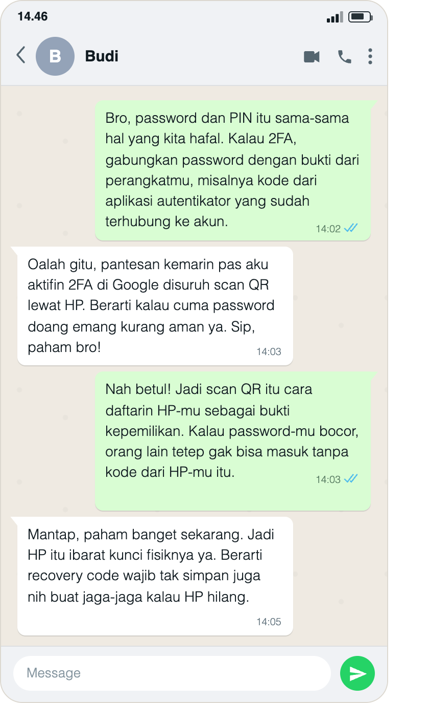
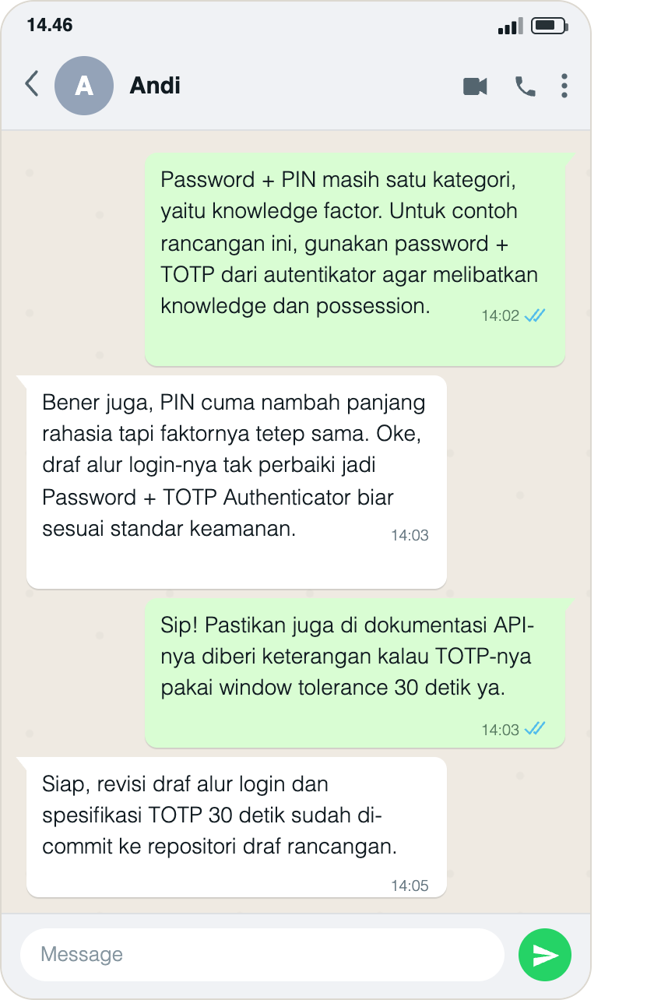
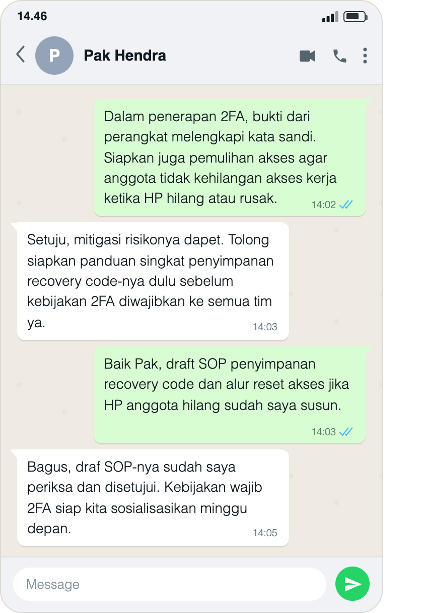
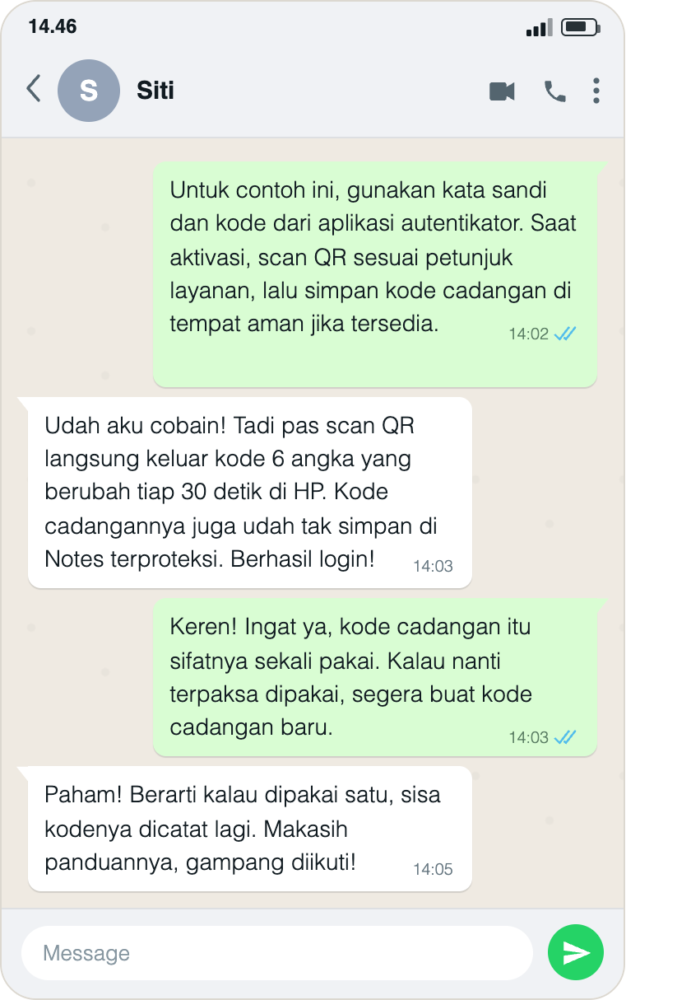
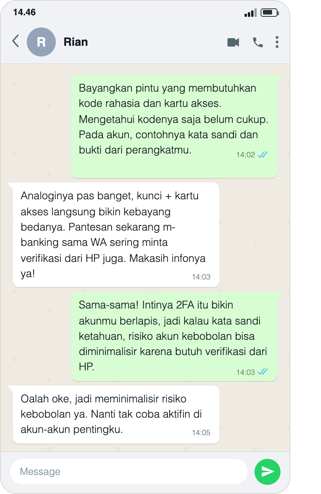

## Kompetensi target

Mengadaptasi repertoire dan language tanpa mengubah core meaning.

## Evidence wajib

- Lima versi untuk friend, technical peer, manager, customer, dan public.
- Alasan perubahan language dan repertoire.
- Feedback understanding dan bukti adaptasi lanjutan (*replay*) yang membentuk *loop* komunikasi tertutup (*closed-loop*) dari tiap target.
- Konteks peserta dan lampiran percakapan untuk setiap target.

## Konteks performance

**Tanggal dan setting:** Penjelasan dan percakapan lanjutan dilakukan melalui WhatsApp. Tanggal percakapan tidak terlihat pada gambar yang saya lampirkan, sehingga tidak saya tentukan berdasarkan jam pesan saja.

**Persons dan relationship:** Saya berperan sebagai pemberi penjelasan kepada lima peserta yang berbeda: Budi untuk versi teman, Andi untuk versi rekan teknis, Pak Hendra untuk versi manajer, Siti untuk versi pengguna, dan Rian untuk versi masyarakat umum. Nama tersebut terlihat pada header gambar masing-masing. Pembagian profil digunakan untuk menyesuaikan kebutuhan informasi, bukan untuk menganggap semua peserta memiliki pengetahuan yang sama. Nama kontak membantu menghubungkan lampiran dengan peserta yang saya ceritakan, tetapi tidak menjadi verifikasi independen identitas atau jabatan mereka.

**Objective dan initial state:** Tujuan saya adalah menjelaskan konsep autentikasi dua faktor (2FA) dengan dua jenis kategori bukti berbeda, lalu menyesuaikan gaya bahasa sesuai kebutuhan profil mitra. Setelah memperoleh tanggapan awal, saya memberikan respons lanjutan (*replay*) untuk mengonfirmasi atau melengkapi pemahaman hingga tercipta *loop* komunikasi yang tertutup.

## Evidence

### Detoks jargon

**Konsep teknis:** Autentikasi dua faktor atau *two-factor authentication* (2FA).

**Definisi teknis:** 2FA menggunakan dua kategori faktor autentikasi yang berbeda (sesuatu yang diketahui, dimiliki, atau melekat pada diri pengguna). Contoh dalam portofolio ini adalah kata sandi (*knowledge*) dan kode dari aplikasi autentikator (*possession*). Rujukan: [Glosarium NIST tentang MFA](https://csrc.nist.gov/glossary/term/multi_factor_authentication).

| Jargon | Arti sederhana |
|---|---|
| Autentikasi | Pemeriksaan bukti identitas saat pengguna masuk ke akun. |
| Knowledge factor | Sesuatu yang diketahui pengguna, misalnya kata sandi atau PIN yang diketik sebagai rahasia login. |
| Possession factor | Bukti bahwa pengguna menguasai autentikator, misalnya aplikasi autentikator di HP. |
| TOTP | Kode sekali pakai yang berubah menurut waktu (misal 6 angka per 30 detik). |
| Recovery code | Kode cadangan untuk memulihkan akses jika tersedia pada layanan yang digunakan. |

**Core meaning:** 2FA memakai dua jenis bukti dari kategori berbeda, sehingga mengetahui kata sandi saja biasanya belum cukup untuk masuk ke akun.

Kata sandi dan PIN yang sama-sama diketik sebagai rahasia login berada dalam satu kategori pengetahuan. PIN yang digunakan untuk membuka autentikator secara lokal merupakan konteks berbeda. Contoh pada portofolio ini adalah kata sandi dan bukti penguasaan autentikator yang sudah terhubung ke akun.

### Lima versi language dan alasan adaptasi

| Target/character | Versi language | Alasan adaptasi |
|---|---|---|
| Friend | “Bro, password dan PIN itu sama-sama hal yang kita hafal. Kalau 2FA, gabungkan password dengan bukti dari perangkatmu, misalnya kode dari aplikasi autentikator yang sudah terhubung ke akun.” | Bahasa akrab dan contoh login sehari-hari membantu menjelaskan perbedaan faktor tanpa jargon berat. |
| Technical peer | “Password + PIN masih satu kategori, yaitu knowledge factor. Untuk contoh rancangan ini, gunakan password + TOTP dari autentikator agar melibatkan knowledge dan possession.” | Istilah kategori faktor dan TOTP dipertahankan agar rekan teknis dapat menilai kelayakan rancangan sistem. |
| Manager | “Dalam penerapan 2FA, bukti dari perangkat melengkapi kata sandi. Siapkan juga pemulihan akses agar anggota tidak kehilangan akses kerja ketika HP hilang atau rusak.” | Penjelasan menekankan manfaat keamanan, mitigasi risiko operasional, dan kebutuhan panduan. |
| Customer/user | “Untuk contoh ini, gunakan kata sandi dan kode dari aplikasi autentikator. Saat aktivasi, scan QR sesuai petunjuk layanan, lalu simpan kode cadangan di tempat aman jika tersedia.” | Pengguna membutuhkan langkah praktis yang dapat langsung diikuti. |
| Public | “Bayangkan pintu yang membutuhkan kode rahasia dan kartu akses. Mengetahui kodenya saja belum cukup. Pada akun, contohnya kata sandi dan bukti dari perangkatmu.” | Analogi konkret membedakan sesuatu yang diketahui dan dimiliki tanpa istilah rumit. |

### Lampiran pelaksanaan, verifikasi identitas, dan replay (Closed-Loop)

::: {.evidence-block}
[Buka folder lampiran W04 di Google Drive](https://drive.google.com/drive/folders/1jhH34ERm7fKIjH-arblicB4G8Mx6BvFL?usp=sharing).

Gambar berikut merupakan salinan file lampiran yang saya berikan dan ditampilkan langsung dari repo, tanpa perubahan isi gambar. Pembaca tidak perlu membuka Drive untuk membaca pesannya. Nama pada header adalah Budi, Andi, Pak Hendra, Siti, dan Rian; tanggal percakapan tidak terlihat.

Isi masing-masing gambar menampilkan urutan **penjelasan → feedback awal → replay → konfirmasi akhir**. Kutipan di bawah mengikuti teks pada gambar. Lampiran memperlihatkan isi yang didokumentasikan, tetapi keaslian sumber percakapan tidak ditetapkan hanya dari tampilannya. Pernyataan tentang commit, SOP, atau pengujian aplikasi dibedakan dari artefak hasil tindakan tersebut, yang belum dilampirkan.
:::

#### 1. Friend — bahasa santai

**Target:** Budi. Nama pada header lampiran: Budi.

{width=480}

[Buka file sumber di Drive](https://drive.google.com/file/d/1pZYQvo9LaQzBOsbVOhDA9v_8NB-2KMPW/view).

> **Izar:** “Bro, password dan PIN itu sama-sama hal yang kita hafal. Kalau 2FA, gabungkan password dengan bukti dari perangkatmu, misalnya kode dari aplikasi autentikator yang sudah terhubung ke akun.”\
> **Respons Awal (Budi):** “Oalah gitu, pantesan kemarin pas aku aktifin 2FA di Google disuruh scan QR lewat HP. Berarti kalau cuma password doang emang kurang aman ya. Sip, paham bro!”\
> **Replay Saya (Adaptasi Lanjutan):** “Nah betul! Jadi scan QR itu cara daftarin HP-mu sebagai bukti kepemilikan. Kalau password-mu bocor, orang lain tetep gak bisa masuk tanpa kode dari HP-mu itu.”\
> **Konfirmasi Akhir Target (Closed-Loop):** “Mantap, paham banget sekarang. Jadi HP itu ibarat kunci fisiknya ya. Berarti recovery code wajib tak simpan juga nih buat jaga-jaga kalau HP hilang.”

**Respons dan batas hasil:** Budi menghubungkan penjelasan dengan bukti dari perangkat dan kebutuhan pemulihan akses. Ini merupakan respons tertulis tentang pemahaman dan rencana menyimpan kode, bukan bukti bahwa kode cadangan sudah disimpan.

#### 2. Technical peer — bahasa teknis

**Target:** Andi. Nama pada header lampiran: Andi.

{width=480}

[Buka file sumber di Drive](https://drive.google.com/file/d/1dULbh2_TPpPCql1frfRlc-iXLN5PLJns/view).

> **Izar:** “Password + PIN masih satu kategori, yaitu knowledge factor. Untuk contoh rancangan ini, gunakan password + TOTP dari autentikator agar melibatkan knowledge dan possession.”\
> **Respons Awal (Andi):** “Bener juga, PIN cuma nambah panjang rahasia tapi faktornya tetep sama. Oke, draf alur login-nya tak perbaiki jadi Password + TOTP Authenticator biar sesuai standar keamanan.”\
> **Replay Saya (Adaptasi Lanjutan):** “Sip! Pastikan juga di dokumentasi API-nya diberi keterangan kalau TOTP-nya pakai window tolerance 30 detik ya.”\
> **Konfirmasi Akhir Target (Closed-Loop):** “Siap, revisi draf alur login dan spesifikasi TOTP 30 detik sudah di-commit ke repositori draf rancangan.”

**Respons dan batas hasil:** Andi menjelaskan bahwa kategori faktor masih sama, lalu melaporkan perubahan draf. Lampiran memuat laporan commit tersebut; riwayat commit dan draf rancangan belum tersedia untuk pemeriksaan langsung. Istilah “window tolerance 30 detik” pada replay perlu diperjelas pada tindak lanjut, sebagaimana catatan teknis di bawah.

#### 3. Manager — bahasa manajemen risiko

**Target:** Pak Hendra. Nama pada header lampiran: Pak Hendra.

{width=480}

[Buka file sumber di Drive](https://drive.google.com/file/d/1ennnBaKYxpQzWL51lqM7Dy_YWd1ltcey/view).

> **Izar:** “Dalam penerapan 2FA, bukti dari perangkat melengkapi kata sandi. Siapkan juga pemulihan akses agar anggota tidak kehilangan akses kerja ketika HP hilang atau rusak.”\
> **Respons Awal (Pak Hendra):** “Setuju, mitigasi risikonya dapet. Tolong siapkan panduan singkat penyimpanan recovery code-nya dulu sebelum kebijakan 2FA diwajibkan ke semua tim ya.”\
> **Replay Saya (Adaptasi Lanjutan):** “Baik Pak, draft SOP penyimpanan recovery code dan alur reset akses jika HP anggota hilang sudah saya susun.”\
> **Konfirmasi Akhir Target (Closed-Loop):** “Bagus, draf SOP-nya sudah saya periksa dan disetujui. Kebijakan wajib 2FA siap kita sosialisasikan minggu depan.”

**Respons dan batas hasil:** Permintaan panduan ditanggapi dengan pernyataan bahwa draf telah disusun, kemudian Pak Hendra menyatakan persetujuan. Dokumen SOP dan bukti sosialisasi belum dilampirkan. Persetujuan dalam pesan tidak saya samakan dengan bukti penerapan kebijakan organisasi.

#### 4. Customer/user — bahasa panduan praktis

**Target:** Siti. Nama pada header lampiran: Siti.

{width=480}

[Buka file sumber di Drive](https://drive.google.com/file/d/1gq3A13tY4sHkwc0OZdIGlfWWaZjtj5Aq/view).

> **Izar:** “Untuk contoh ini, gunakan kata sandi dan kode dari aplikasi autentikator. Saat aktivasi, scan QR sesuai petunjuk layanan, lalu simpan kode cadangan di tempat aman jika tersedia.”\
> **Respons Awal (Siti):** “Udah aku cobain! Tadi pas scan QR langsung keluar kode 6 angka yang berubah tiap 30 detik di HP. Kode cadangannya juga udah tak simpan di Notes terproteksi. Berhasil login!”\
> **Replay Saya (Adaptasi Lanjutan):** “Keren! Ingat ya, kode cadangan itu sifatnya sekali pakai. Kalau nanti terpaksa dipakai, segera buat kode cadangan baru.”\
> **Konfirmasi Akhir Target (Closed-Loop):** “Paham! Berarti kalau dipakai satu, sisa kodenya dicatat lagi. Makasih panduannya, gampang diikuti!”

**Respons dan batas hasil:** Siti melaporkan scan QR, kode yang berubah, penyimpanan kode cadangan, dan keberhasilan login. Screenshot aplikasi tidak disertakan, sehingga yang tersedia adalah laporan peserta. Jawaban akhir menyebut kode yang tersisa, bukan konfirmasi bahwa satu set kode baru sudah dibuat. Petunjuk saya tentang penggantian kode perlu mengikuti aturan layanan, bukan dianggap kewajiban setelah setiap pemakaian.

#### 5. Public — bahasa analogi

**Target:** Rian. Nama pada header lampiran: Rian.

{width=480}

[Buka file sumber di Drive](https://drive.google.com/file/d/14zaE9ObWSibjYElY_KVAStBj_7hk7lQY/view).

> **Izar:** “Bayangkan pintu yang membutuhkan kode rahasia dan kartu akses. Mengetahui kodenya saja belum cukup. Pada akun, contohnya kata sandi dan bukti dari perangkatmu.”\
> **Respons Awal (Rian):** “Analoginya pas banget, kunci + kartu akses langsung bikin kebayang bedanya. Pantesan sekarang m-banking sama WA sering minta verifikasi dari HP juga. Makasih infonya ya!”\
> **Replay Saya (Adaptasi Lanjutan):** “Sama-sama! Intinya 2FA itu bikin akunmu berlapis, jadi kalau kata sandi ketahuan, risiko akun kebobolan bisa diminimalisir karena butuh verifikasi dari HP.”\
> **Konfirmasi Akhir Target (Closed-Loop):** “Oalah oke, jadi meminimalisir risiko kebobolan ya. Nanti tak coba aktifin di akun-akun pentingku.”

**Respons dan batas hasil:** Rian menyebut manfaat pengurangan risiko dan menyatakan rencana aktivasi. Kalimat “nanti tak coba” merupakan niat, bukan bukti bahwa fitur sudah diaktifkan.

### Pemeriksaan makna dan batas penjelasan

Inti pesan yang dipertahankan adalah kebutuhan dua kategori bukti berbeda. Kutipan percakapan tidak saya ubah untuk menyembunyikan bagian yang kurang tepat. Koreksi berikut merupakan hasil pemeriksaan tulisan, bukan klaim bahwa replay koreksi tambahan sudah dilakukan:

- **Batas manfaat keamanan:** Ucapan “tetep gak bisa masuk” kepada Budi terlalu mutlak. Rumusan yang lebih tepat adalah “kata sandi yang bocor saja biasanya belum cukup untuk masuk”. OTP yang diketik manual tetap berisiko terhadap phishing. [NIST — persyaratan autentikator](https://pages.nist.gov/800-63-4/sp800-63b/authenticators/)
- **Interval dan toleransi TOTP:** Interval pembentukan kode 30 detik berbeda dari toleransi verifikasi terhadap keterlambatan atau perbedaan jam perangkat. Keduanya perlu disebut terpisah pada rancangan. [RFC 6238](https://www.rfc-editor.org/info/rfc6238/)
- **Kode cadangan:** Aturan penggantian mengikuti layanan. Pada akun Google, kode yang sudah dipakai menjadi tidak aktif, sedangkan kode lain yang belum dipakai masih dapat digunakan. Membuat satu set baru menonaktifkan set lama; tidak wajib membuat set baru setiap kali satu kode dipakai. [Panduan kode cadangan Google](https://support.google.com/accounts/answer/1187538?hl=en)

Analogi perangkat membantu menjelaskan kategori kepemilikan, tetapi memiliki sembarang HP tidak otomatis menjadi faktor autentikasi. Contoh yang dimaksud adalah autentikator yang sudah terhubung dengan akun, bukan perangkat apa pun.

## Analisis komunikasi

| Elemen | Evidence dan analisis |
|---|---|
| Person & character | Lima peserta memiliki profil komunikasi berbeda. Saya membedakan kebutuhan teman, rekan teknis, manajer, pengguna, dan publik; nama pada lampiran membantu menghubungkan respons dengan profil tanpa menjadi bukti jabatan formal. |
| Objective & state | Tujuan saya adalah menjaga makna dua faktor dan menanggapi feedback. Respons awal menunjukkan pengalaman aktivasi, kebutuhan rancangan, permintaan panduan, laporan percobaan, serta manfaat analogi; pemahaman sebelum penjelasan tidak diukur secara terpisah. |
| Repertoire & language | Bahasa santai, kategori teknis, pertimbangan risiko, petunjuk, dan analogi digunakan sesuai profil. Bagian yang terlalu mutlak atau kurang tepat secara teknis dipisahkan dalam refleksi. |
| Response & adaptation | Lampiran menampilkan balasan saya setelah feedback dan respons lanjutan peserta. Permintaan panduan manajer menjadi dasar tindak lanjut; pada peserta lain saya menambahkan penjelasan faktor, rincian rancangan, kode cadangan, atau batas manfaat. Koreksi teknis setelah pemeriksaan belum menjadi bukti replay baru. |
| Agreement/action | Ada rencana aktivasi, laporan commit dan percobaan, serta persetujuan yang dinyatakan atas SOP. Laporan tindakan dan komitmen dibedakan dari bukti hasil, sebab dokumen SOP, riwayat commit, dan log aplikasi belum dilampirkan. |
| Relationship outcome | Peserta melanjutkan percakapan dengan tanggapan, permintaan, dan apresiasi. Ini menunjukkan keterlibatan pada episode yang didokumentasikan, bukan bukti perubahan hubungan jangka panjang. |

## Penggunaan AI

Saya menggunakan AI untuk membantu menata kalimat, menyusun kerangka replay, memeriksa ketepatan istilah, dan merapikan format Quarto. Instruksi penting yang saya berikan adalah memperbaiki portofolio, memasang gambar langsung di repo, dan menyelaraskan konteks W04 dengan lima peserta yang saya nyatakan benar-benar terlibat.

## Feedback dan tindak lanjut

**Feedback yang diterima:** Pak Hendra meminta panduan pemulihan. Andi menyatakan kebutuhan perubahan draf, Siti melaporkan percobaan penggunaan, sedangkan Budi dan Rian menghubungkan konsep dengan keamanan akun sehari-hari. Respons lanjutan tersedia pada masing-masing lampiran.

**Adaptasi dan tindak lanjut yang sudah dilakukan:**

1. Menampilkan lima gambar secara lokal, beserta transkrip penjelasan, feedback, replay, dan respons akhir.
2. Mencatat kebutuhan dan respons tiap peserta tanpa menyamakan niat atau laporan tindakan dengan bukti implementasi.
3. Memisahkan koreksi teknis setelah pemeriksaan dari isi percakapan yang tercantum pada gambar.

**Refleksi:** Bahasa sederhana membantu membuka percakapan, tetapi penyederhanaan bisa menghasilkan klaim keamanan yang terlalu mutlak. Saya juga perlu memeriksa apakah respons akhir benar-benar menjawab poin yang saya jelaskan; jawaban Siti tentang kode yang tersisa belum sama dengan konfirmasi membuat set baru.

**Next practice:** Saya akan meminta peserta menjelaskan kembali perbedaan password + PIN dan password + autentikator dengan bahasanya sendiri. Saya juga akan menyampaikan koreksi teknis yang diperlukan, mencatat tanggal kegiatan, dan menyimpan artefak hasil tindakan jika tindakan tersebut menjadi klaim portofolio. Rencana ini belum dinyatakan sebagai kegiatan yang sudah dilakukan.

## Self-assessment

| Dimensi | Skor 1–4 | Evidence singkat |
|---|---:|---|
| Person & Character | 4 | Lima profil dibedakan menurut kebutuhan informasi dan peran komunikasi; batas identifikasi melalui nama kontak dijelaskan. |
| Objective & State | 3 | Makna inti, tujuan, dan respons awal dicatat; pemahaman sebelum penjelasan tidak diukur terpisah. |
| Repertoire, Language & AI | 4 | Lima versi bahasa, alasan adaptasi, koreksi teknis, dan peran AI dinyatakan. |
| Response & Adaptation | 4 | Setiap lampiran memuat feedback, balasan lanjutan, dan respons akhir; keterbatasan serta kebutuhan koreksi lanjutan dicatat. |
| Agreement, Action & Relationship | 3 | Rencana, laporan tindakan, dan persetujuan tersedia; artefak commit, SOP, dan pengujian belum menjadi bukti hasil independen. |

**Total:** 18 / 20

Skor ini merupakan penilaian mandiri, bukan hasil penilaian dosen.

::: assessor-only
### Assessment dosen

**Skor:** — / 20\
**Evidence yang mendukung:** —\
**Prioritas perbaikan:** —\
**Keputusan:** Belum dinilai / Perlu revisi / Tercapai
:::
